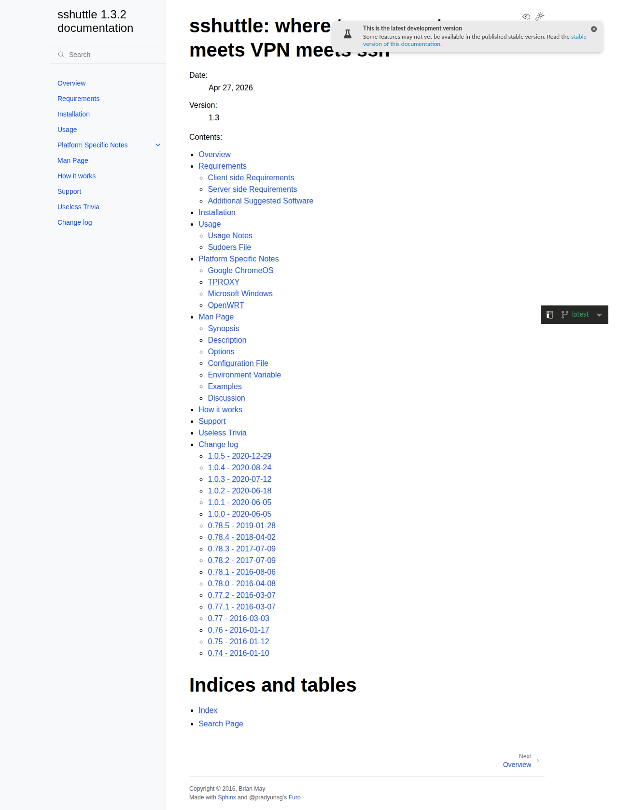

# Visited: https://sshuttle.readthedocs.org/en/latest/
**Time:** Thu May  7 19:06:21 UTC 2026

## Screenshot

## Raw HTML
[page.html](./page.html)

## Downloaded Media (0 files)
_No media files downloaded_

## Other Links
- [#](#)
- [#furo-main-content](#furo-main-content)
- [#indices-and-tables](#indices-and-tables)
- [#sshuttle-where-transparent-proxy-meets-vpn-meets-ssh](#sshuttle-where-transparent-proxy-meets-vpn-meets-ssh)
- [#svg-arrow-right](#svg-arrow-right)
- [#svg-eye](#svg-eye)
- [#svg-menu](#svg-menu)
- [#svg-moon](#svg-moon)
- [#svg-moon-with-sun](#svg-moon-with-sun)
- [#svg-sun](#svg-sun)
- [#svg-sun-with-moon](#svg-sun-with-moon)
- [#svg-toc](#svg-toc)
- [/_/static/javascript/readthedocs-addons.js](/_/static/javascript/readthedocs-addons.js)
- [_sources/index.rst.txt](_sources/index.rst.txt)
- [_static/doctools.js?v=9bcbadda](_static/doctools.js?v=9bcbadda)
- [_static/documentation_options.js?v=8ca9e7a0](_static/documentation_options.js?v=8ca9e7a0)
- [_static/pygments.css?v=03e43079](_static/pygments.css?v=03e43079)
- [_static/scripts/furo.js?v=46bd48cc](_static/scripts/furo.js?v=46bd48cc)
- [_static/sphinx_highlight.js?v=dc90522c](_static/sphinx_highlight.js?v=dc90522c)
- [_static/styles/furo-extensions.css?v=8dab3a3b](_static/styles/furo-extensions.css?v=8dab3a3b)
- [_static/styles/furo.css?v=7bdb33bb](_static/styles/furo.css?v=7bdb33bb)
- [changes.html](changes.html)
- [changes.html#id1](changes.html#id1)
- [changes.html#id10](changes.html#id10)
- [changes.html#id14](changes.html#id14)
- [changes.html#id17](changes.html#id17)
- [changes.html#id2](changes.html#id2)
- [changes.html#id21](changes.html#id21)
- [changes.html#id23](changes.html#id23)
- [changes.html#id26](changes.html#id26)
- [changes.html#id27](changes.html#id27)
- [changes.html#id28](changes.html#id28)
- [changes.html#id29](changes.html#id29)
- [changes.html#id30](changes.html#id30)
- [changes.html#id31](changes.html#id31)
- [changes.html#id32](changes.html#id32)
- [changes.html#id33](changes.html#id33)
- [changes.html#id4](changes.html#id4)
- [changes.html#id6](changes.html#id6)
- [changes.html#id8](changes.html#id8)
- [chromeos.html](chromeos.html)
- [genindex.html](genindex.html)
- [how-it-works.html](how-it-works.html)
- [https://github.com/pradyunsg/furo](https://github.com/pradyunsg/furo)
- [https://pradyunsg.me](https://pradyunsg.me)
- [https://www.sphinx-doc.org/](https://www.sphinx-doc.org/)
- [installation.html](installation.html)
- [manpage.html](manpage.html)
- [manpage.html#configuration-file](manpage.html#configuration-file)
- [manpage.html#description](manpage.html#description)

## Stats
- Links: 70
- Media: 0
